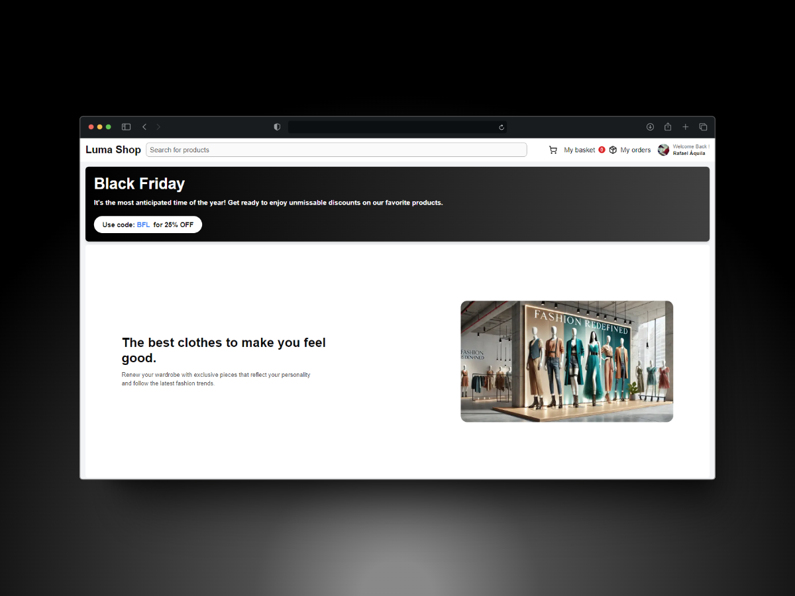

<p align="center">
   
</p>

<h1 align="center">
    <a href="#">Luma Shop</a>
</h1>

<p align="center">
    Luma Shop is your destination for modern e-commerce, offering a seamless shopping experience powered by cutting-edge technology.
</p>
<p align="center">
  <a href="https://github.com/rafael-bit/luma-shop">
  	
  </a>
</p>

# 🚀 How It Works

Luma-Shop provides an efficient and user-friendly e-commerce platform. Built with modern tools, it ensures a seamless shopping experience with powerful integrations for content management, payment processing, state management, authentication, and responsive design.

## 👷 Running Locally

#### Clone the repository

```bash
git clone https://github.com/rafael-bit/luma-shop
```

#### Install dependencies and run the application in development mode

```bash
yarn
yarn dev
```

Open this address in your browser: [Luma-Shop](http://luma-shop.vercel.app/)

# 💻 Technologies

Luma-Shop is powered by the following technologies:

- [Next.js](https://nextjs.org/) - React framework for server-side rendering and static site generation.
- [Sanity](https://www.sanity.io/) - Headless CMS for managing and delivering content.
- [Stripe](https://stripe.com/) - Payment processing platform.
- [Zustand](https://zustand-demo.pmnd.rs/) - Lightweight state management library.
- [Clerk](https://clerk.dev/) - Authentication and user management.
- [Tailwind CSS](https://tailwindcss.com/) - Utility-first CSS framework.

#  🚩 Bugs

Feel free to **report a new issue** with an appropriate title and description.

# 💡 Author

- Rafael Áquila ([@rafael-bit](https://github.com/rafael-bit))

# 🔧 Contributing

Check the [contribution page](https://github.com/rafael-bit/luma-shop/) for guidelines on reporting issues, starting discussions, and contributing to the project.